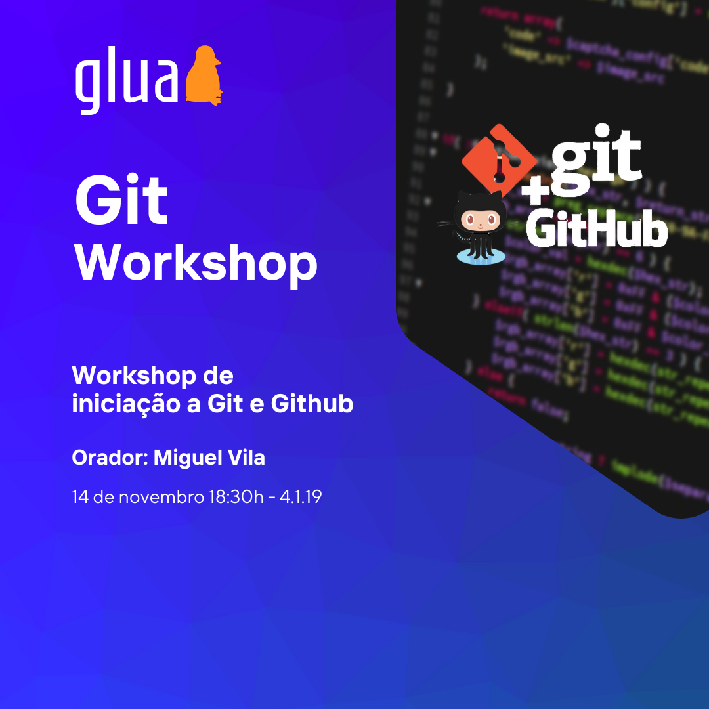

# Workshop de Iniciação ao Git e GitHub

Já ouviste falar de Git ou sabes o que é mas não entendes como trabalhar com ele?

O GLUA dá-te a oportunidade de conhecer e aprender a trabalhar com Git, a ferramenta mais usada para controlo de versões, e com o GitHub que é a maior plataforma de hospedagem de código e ficheiros com controlo de versões.

O Workshop é direcionado para todos os que necessitem desta ferramenta muito importante.

## Detalhes do evento
👨‍💻 Miguel Vila

📆 14 de Novembro

🕖 18:30

📍 DETI na sala 4.1.19

📝 [Inscrições](https://bit.ly/glua-gws)

## Requisitos:
- Computador pessoal
- Git instalado
- Conta GitHub criada ([link](https://github.com/))
- Vontade de aprender

## Slides:
[Link](https://glua.ua.pt/assets/ws/ws_git_2022.pdf)

## Como instalar Git
### Linux
#### Ubuntu/Debian/Linux Mint/Pop!_OS
`sudo apt install git`
#### Fedora/RHEL/CentOS
`sudo dnf install git`
#### Arch Linux
`sudo pacman -S git`
#### Outros sistemas baseados em Linux
Seguir o instalador em [https://git-scm.com/download/linux](https://git-scm.com/download/linux)
### Windows
Seguir o instalador em [https://git-scm.com/download/win](https://git-scm.com/download/win)
### macOS
#### via Homebrew
`brew install git`
#### via MacPorts
`sudo port install git`
#### Outros métodos
Seguir o instalador em [https://git-scm.com/download/mac](https://git-scm.com/download/mac)
