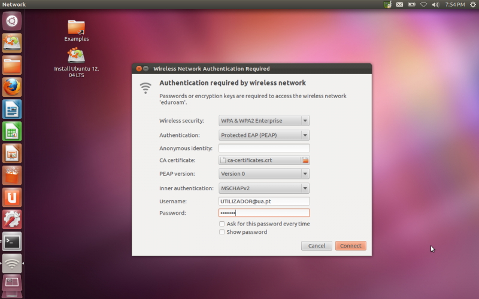
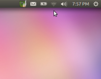
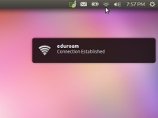
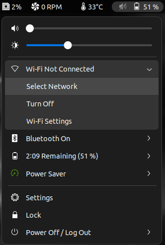
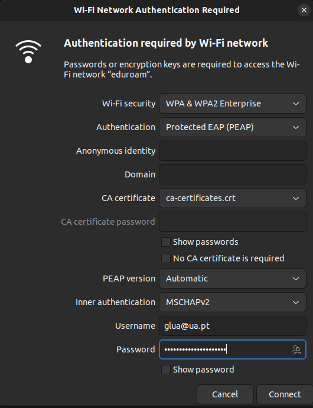
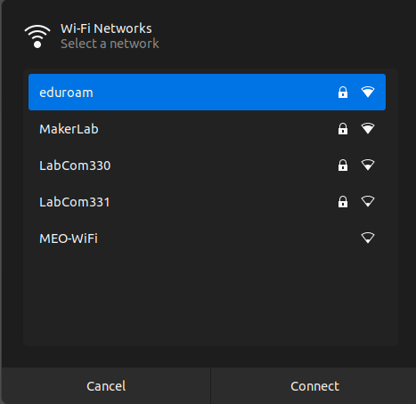
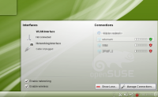
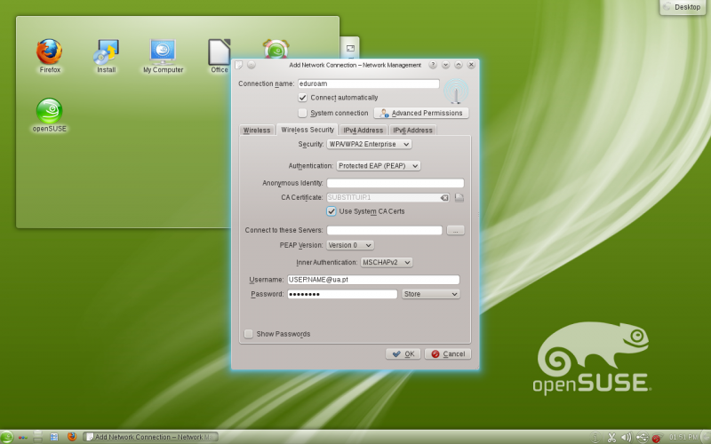

Neste tutorial pode encontrar informações de como configurar a rede eduroam na sua distribuição de GNU/Linux.


## Certificados

Para poder conectar-se à rede **eduroam**, vai ser preciso indicar um certificado de autenticação, cujo destino e ficheiro difere entre distribuições GNU/LINUX. 
Assim sendo, pode confirmar na seguinte tabela qual é o caminho e ficheiro para as diferentes distribuições:

Para poder conectar-se à rede **eduroam** é necessário indicar um certificado de autentificação, cuja a sua localização difere para as diferentes distribuições GNU/LINUX. Assim sendo, pode confirmar na seguinte tabela qual é o caminho do ficheiro para as diferentes distribuições.

|            Distribuição             |                  Ficheiro a selecionar                   |
|:-----------------------------------:|:--------------------------------------------------------:|
| **Debian/Ubuntu/Gentoo/Arch Linux** | /etc/ssl/certs/ca-certificates.crt |
| **Fedora/RHEL**                     | /etc/pki/tls/certs/ca-bundle.crt   |
| **openSUSE/SLE**                    | /etc/ssl/ca-bundle.pem             |


________________________________

>Caso continue sem conexão, selecione o certificado **_DigiCert_Assured_ID_Root_CA.pem_**

## Unity

No canto superior direito deve selecionar o ícon de rede 
De seguida preencher os campos com os seguintes dados:

Campo                   |Valor
:---------------------: |:--------------------:
Wireless Security       | WPA&WPA2 Enterprise
Autentication           | Protected EAP (PEAP)
Anonymous Identity      |                     
CA certificate          | [Ver na tabela dos Certificados](#certificados)  
PEAP version            | Version 0           
Inner authentication    | MSCHAPv2            
Username                | mail@ua.pt          
Password                | *****



Depois de preencher todos os campos, conforme foi referido anteriormente, basta proceder a conexão e esperar


Após os dados serem validados irá receber a seguinte mensagem de ligação concluída com sucesso:


________________________________

## Gnome3

No canto superior direito, como no [Unity](#unity), deve selecionar o ícon de rede 


Após selecionar a rede **eduroam**, deverá preencher os dados como na secção do [Unity](#unity).



Depois de confirmar basta aguardar a validação de dados.



________________________________

## KDE

No canto inferior direito selecionar o ícon de rede. 


Após selecionar a rede **eduroam**, deverá preencher os dados como nas secções anteriores. (ex: [Unity](#unity))



Despois de confirmar os dados inseridos, estes serão validados e terá a conexão com a rede **eduroam**.


________________________________

## Linha de Comandos

<!--TODO: Use a warning-->
(**Atenção: Apenas para utilizadores com experiência...**)

Caso prefira conectar-se a rede **eduroam** utilizando a consola siga os seguintes passos:

1 - Criar o ficheiro eduroam.conf e guardar o mesmo na home (~):

```bash
ctrl_interface=/var/run/wpa_supplicant

network={
        ssid="eduroam"
        key_mgmt=WPA-EAP
        eap=PEAP
        ca_cert="SUBSTITUIR"		# localização do ficheiro de certificados
        identity="UTILIZADOR@ua.pt"	# Substituir pelas vossas
        password="**********"		# credenciais de acesso
}
```
>caso queira iniciar com a eduroam por padrão adicione a parte do network ao ficheiro /etc/wpa_supplicant/wpa_supplicant.conf (Os passos 3 e 4 passam a ser desnecessários)

2 - Alterar o texto ***SUBSTITUIR*** para o certificado de acordo com a sua distribuição

<!--TODO: Use a warning-->
**Consultar a secção dos [certificados](#certificados)**

```bash
ca_cert="SUBSTITUIR"
```

3 - De seguida, execute o seguinte comando

```bash
sudo pkill wpa_supplicant && sudo wpa_supplicant -i wlan0 -c /home/$USERNAME/eduroam.conf
```

4 - Por fim, será necessário fazer um pedido ao servidor de DHCP, também como súper-utilizador(___root___). Para tal, é preciso abrir outra consola e escrever:

```bash
sudo dhclient wlan0
```

Foi usado o cliente de DHCP `dhclient` (típico de Debian/Ubuntu/Fedora), mas poderia ser usado qualquer outro à escolha, por exemplo, o `dhcpcd` (típico de ArchLinux/Gentoo).

>Caso tenha problemas de "_disconnects_", ou problemas em obter um endereço IP, na distribuição Arch Linux, adicione a seguinte linha na secção _main_ do ficheiro _NetoworkManager.conf_ que se encontra em */etc/NetoworkManager/NetoworkManager.conf*
```bash
DHCP = dhclient
```

>caso não queira abrir outra consola, pode-se executar o _wpa_supplicant_ em segundo plano usando:
~~~bash
sudo wpa_supplicant -i wlan0 -c/home/$USERNAME/eduroam.conf -B
~~~

Pronto, tem acesso à rede eduroam!
