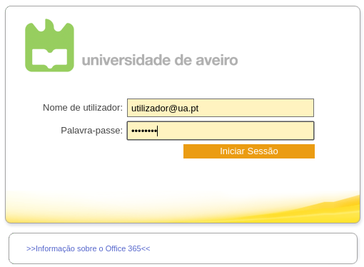
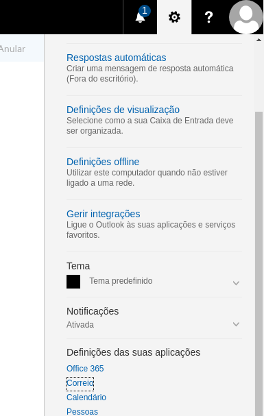
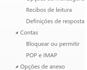
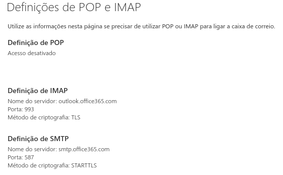
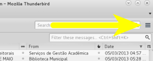
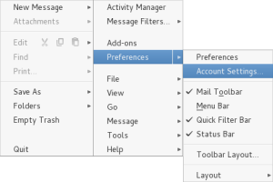
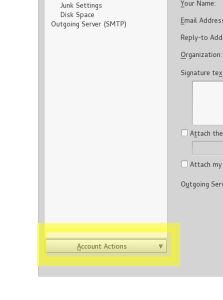
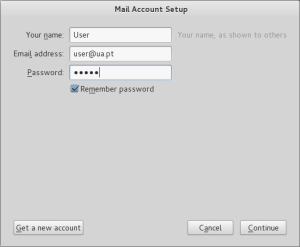
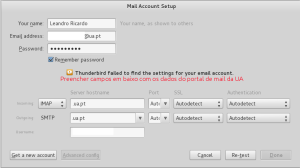

## Conteúdos
1. [Obter dados de acesso](#get)
2. [Configuração de clientes](#conf)
    1. [Thunderbird](#thunderbird)

## Obter dados de acesso {#get}
Entre no email da UA:

No canto superior direito, no menu "Definições", selecionar "Correio":

No lado esquerdo, em "Opções" -> "Contas", selecionar "POP e IMAP":

Aparecerá as definições do correio(atenção que os dados da imagem podem variar):

___________________________________________

## Configuração de clientes {#conf}
### Thunderbird
Abra o Tunderbird e no canto superior direito:

Vá a preferências, "Definições de Conta" (Preferences, Account Settings):

Em baixo, do lado esquerdo clique em "Ações de conta" (Account Actions), e selecione "Adicionar novo email" (Add new e-mail):

Insira os dados básicos da sua conta de email, selecione “Continuar” (Continue) e aguarde:

No fim de aguardar alguns segundos, preencha os campos que faltam em baixo, com os dados existentes no portal de email da UA (último passo da secção anterior), deixando os restantes campos em “Detectar automaticamente” (Autodetect):

Por fim, seleccione “Voltar a testar” (Re-test). Após aguardar, aparecerá uma mensagem a informar que a configuração é aceite pelo servidor. Selecione “Confirmar” (Done).
