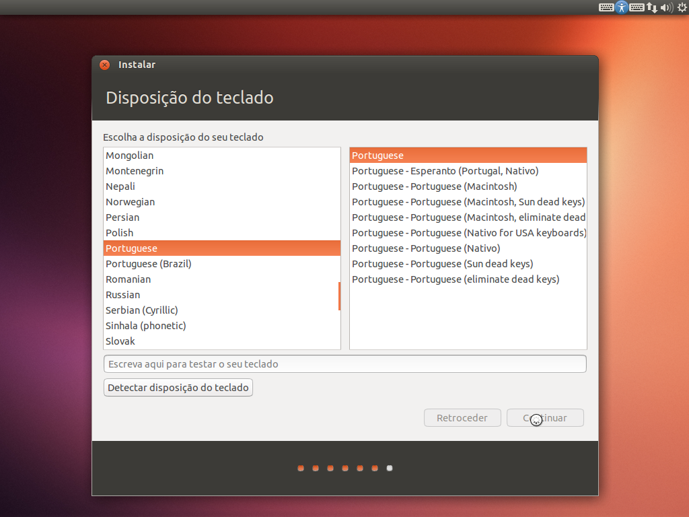

<!--TODO: make adequate warning-->
>Este guia está otimizado para a versão 16.04 LTS. Algumas imagens podem diferir ligeiramente em futuras versões.
>
>É altamente recomendado a fazer uma cópia de segurança dos seus ficheiros. Se não pretende optar por dual-boot ou está pouco à vontade, considere utilizar uma máquina virtual.

## Pré-requisitos
1. Ter um meio de instalação (DVD ou USB);
2. Ter uma ligação à Internet (por cabo se possível);
3. Em caso de desejar dual boot é obrigatório o particionamento do disco;

>Multi-boot / Dual-boot: Esquema que permite um computador executar dois (dual) ou mais (multi) sistemas operativos, quando este é ligado.

### Criando um espaço vazio com o gestor de partições do Windows 

O desejo da maior parte dos utilizadores é não perder os dados da instalação já existente do Windows. De maneira a eliminar possíveis erros iremos criar um espaço vazio com o “Gestor de discos do Windows” e criar as partições no “Instalador do Ubuntu”.

>Pode fazer a mesma coisa com o instalador do Ubuntu, mas qualquer erro de particionamento poderia dar origem à perda de dados. Este método é menos falível nesse sentido.

No Windows o “Gestor de partições do Windows” permite gerir partições do disco rígido.

Este método é mais seguro para os principiantes porque conseguem à partida, separar um espaço que é independente da instalação do Windows (e portanto sem riscos).

## Passos para a criação de um espaço não alocado 

No Windows fazer a combinação de teclas Windows+R.

Escreva diskmgmt.msc e confirmar clicando no botão OK.

Com o botão direito do rato selecione uma partição com espaço (tipicamente, poderá selecionar a partição c:\ ou  caso tenha uma segunda partição d:\) e selecione "reduzir".

>### Cálculo do valor a reduzir
>+ / : >25GB, onde o sistema e programas estarão localizados
>+ /swap : 4GB ou se pretender hibernação reserve o mesmo tamanho da RAM
>+ /home : tamanho à discrição, equivalente à pasta pessoal no windows
>
>Total a reduzir: Sistema + swap + home

Escreva o valor que deseja em Megabytes(conversão de GB para MB, multiplique o número de GB por 1024) e confirme clicando no botão reduzir.

>Se a partição utilizada estiver fragmentada poderá acontecer o seguinte erro:
>
>Nesse caso deverá desfragmentar o disco (com a ferramenta do Windows ou com outra – como o Piriform Defraggler)

Aguarde e depois disso, o espaço em branco foi criado com sucesso!

De seguida, iremos introduzir a média de instalação.

## Considerações sobre o arranque
No Windows fazer a combinação de teclas Windows+R.
Escreva POWERCFG.CPL e confirmar clicando no botão OK.

Selecione “Escolher o que fazem os botões para ligar/desligar”.

Selecione “Alterar definições que estão atualmente indisponíveis”

Desmarque a opção “Ativar o arranque rápido”.

Reinicie o computador e entre na BIOS / firmware UEFI.

>Se não sabe entrar na BIOS, [leia este artigo][read].
>
>Em grande parte dos computadores, existe um popup (BBS Popup) que permite mudar a opção de arranque naquela instância. Por exemplo, no caso da Asus essa tecla é o ESC.

### Configurações adicionais para UEFI
>Se o computador for de 2013, ou mais recente, ou se vinha com o windows 8, ou superior, então tem provávelmente UEFI. Se não tem UEFI, salte para o próximo passo. 

Nos últimos anos, um novo sistema de arranque (UEFI) substituiu o antigo (MBR). É necessário ter precauções adicionais se o seu computador tem UEFI.

Para instalar a distribuição Ubuntu num sistema UEFI é recomendado a prestar atenção aos seguintes aspetos (se não estiver presente qualquer um deles, ignore):
1.  Desative na BIOS a opção “Fast Boot” (geralmente na aba “Boot”);
2.  Ative a opção “USB Legacy Emulation” (geralmente na aba “Advanced”);
3.  Desative a opção “Secure Boot” (geralmente na aba “Security”);

### Mudar a ordem de arranque
Mude a ordem de arranque (geralmente na aba "Boot")
No fim, não se esqueça de guardar as alterações ("Exit Saving Changes", na aba "Exit").

## Instalação
Logo depois, o programa de instalação surge (normalmente em inglês). Escolha a linguagem que pretende.

Clique nas duas opções (marcadas a laranja na imagem).
> Se estiver a instalar o sistema na universidade, deixe a primeira opção desmarcada.

Quanto ao tipo de instalação, escolha a opção “Mais alguma coisa…”

### Criação de partições
De seguida poderá ter uma configuração mais ou menos semelhante com esta. O importante a reter é que apenas irá tocar na parte não alocada.
Este ecrã mostra o espaço livre criado anteriormente no Windows.

Para cada ponto de montagem (/, /swap e /home), clique no botão +, com seleção no espaço livre e preencha os seguintes dados e selecione “OK”:
+ Tamanho: deverá inserir o tamanho determinado em [Cálculo do espaço a reduzir](#passos-para-a-criação-de-um-espaço-não-alocado); Note que neste caso, o utilizador optou por utilizar apenas 20GB.
+ Tipo de nova partição: irrelevante para este caso de aprendizagem.
+ Localização para a nova partição: “Início deste espaço”.
+ Utilizar como: “Sistema de ficheiros Ext4 com journal”, no caso da partição / e /home, ou “Área de swap”, no caso da partição /swap.
+ Mount point: / ou /home ou /swap.

>Nota de extrema importância: Restrinja-se a fazer especificamente o que manda o tutorial.
>
>Como pode verificar, no dispositivo /dev/sda2 encontra-se partição de EFI. Não apague ou modifique essa partição, sob o risco de ficar sem arranque doutro sistema operativo que já esteja instalado no seu computador.
>
>A manipulação das outras partições podem incorrer em perdas de dados.

Comece a instalação, clicando no botão “Instalar agora”. Deverá agora configurar, as várias definições.

### Processo de instalação
Esta parte é mais fácil: após selecionar o botao “Instalar agora”, o setup irá configurar proceder à instalação. Ao mesmo tempo, é pedido ao utilizador que defina várias definições: teclado, fuso horário e fuso horário.

Selecione o fuso horário.

E o esquema do teclado.

Configure o nome de utilizador e a palavra-passe:

Por fim, deverá aguardar a conclusão do setup.

## Resolução de problemas 
### Hora muda quando se muda entre Windows e Linux
#### Para Windows 7, 8 e 10
Copie e execute como administrador na PowerShell do Windows (ou na Linha de Comando do Windows) a seguinte linha
~~~powerhell
reg add "HKEY_LOCAL_MACHINE\System\CurrentControlSet\Control\TimeZoneInformation" /v RealTimeIsUniversal /d 1 /t REG_DWORD /f
~~~
