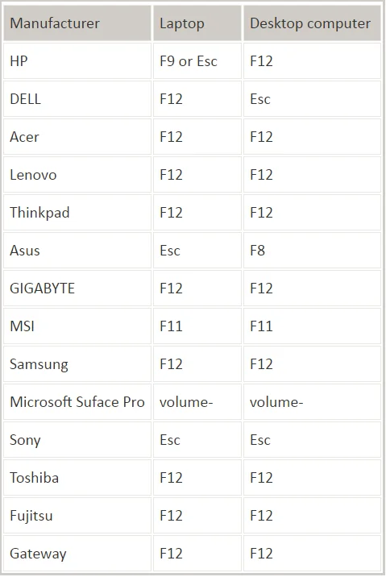

<!--TODO: make adequate warning-->

Este guia está feito para a versão 22.04 LTS. 
Algumas imagens podem diferir ligeiramente em versões futuras do Ubuntu, ainda que o processo em si pouco mude.



Quando instalar em hardware real, **faça um backup integral do disco**.
Ainda que o processo seja seguro, erros podem acontecer.


## Pré-requisitos
1. Ter um meio de instalação (DVD ou USB);
2. Ter uma ligação à Internet (preferencialmente por cabo);
<!--3. Em caso de desejar dual boot é obrigatório o particionamento prévio do disco;-->


Multi-boot / Dual-boot: Esquema que permite a um computador entrar em dois (dual) ou mais (multi) sistemas operativos quando é ligado.


### Criação um espaço vazio com o gestor de partições do Windows 

O desejo da maior parte dos utilizadores é não perder os dados da instalação já existente do Windows. De maneira a eliminar possíveis erros iremos criar um espaço vazio com o "Gestor de discos do Windows" e criar as partições no "Instalador do Ubuntu".


Pode fazer a mesma coisa com o instalador do Ubuntu, mas qualquer erro de particionamento poderia dar origem à perda de dados. 
Este método é menos falível nesse sentido.


No Windows o "Gestor de partições do Windows" permite gerir partições do disco rígido.

Este método é mais seguro para os principiantes porque conseguem à partida, separar um espaço que é independente da instalação do Windows (e portanto sem riscos).

## Passos para a criação de um espaço não alocado 

No Windows fazer a combinação de teclas Windows+R.

Escreva diskmgmt.msc e confirmar clicando no botão OK.


Com o botão direito do rato selecione uma disco com espaço (tipicamente, poderá selecionar a eedisco C:\ ou  caso tenha uma segunda disco D:\) e selecione "reduzir".



### Cálculo do valor a reduzir
+ / : >60GB, onde o sistema e programas estarão localizados
+ /swap : 4GB ou, se pretender hibernação, reserve o mesmo tamanho da RAM
<!--+ /home : tamanho à discrição, equivalente à pasta pessoal no windows-->

Total a reduzir: Sistema + swap


Escreva o valor que deseja em Megabytes(conversão de GB para MB, multiplique o número de GB por 1024) e confirme clicando no botão reduzir.


Se a partição utilizada estiver fragmentada poderá acontecer o seguinte erro:

Nesse caso, deverá desfragmentar o disco (com a ferramenta do Windows ou com outra – como o Piriform Defraggler)


Aguarde e, depois disso, o espaço não alocado foi criado com sucesso!

De seguida, iremos introduzir a média de instalação.

## Considerações sobre o arranque
No Windows fazer a combinação de teclas Windows+R.
Escreva POWERCFG.CPL e confirmar clicando no botão OK.


Selecione "Escolher o que fazem os botões para ligar/desligar".


Selecione "Alterar definições que estão atualmente indisponíveis"


Desmarque a opção "Ativar o arranque rápido".


Reinicie o computador e entre na BIOS / firmware UEFI.


Se não sabe entrar na BIOS, tente combinações das teclas `F2`, `F8`, `F10` e `Esc`

Em grande parte dos computadores, existe um popup (BBS Popup) que permite mudar a opção de arranque neste arranque. Por exemplo, no caso da Asus essa tecla é o ESC.


### Configurações adicionais para UEFI


Se o computador for de 2013 ou mais recente, ou se vinha com o windows 8 ou superior, então tem provavelmente UEFI. Se não tem UEFI, salte para o próximo passo. 


Nos últimos anos, um novo sistema de arranque (UEFI) substituiu o antigo (MBR). É necessário ter precauções adicionais se o seu computador tem UEFI.

Em sistemas UEFI, desative na BIOS a opção "Fast Boot" (geralmente na aba "Boot").


A maioria das distribuições de Linux não assinam o kernel nem drivers, o que impede sistemas com **Secure Boot** de ligar.

O Ubuntu **não tem** este problema.


### Mudar a ordem de arranque
Mude a ordem de arranque (geralmente na aba "Boot") de modo a que o disco/pen estejam em primeiro lugar.

No fim, não se esqueça de guardar as alterações ("Exit Saving Changes", na aba "Exit").

## Instalação
Logo depois, o programa de instalação surge (normalmente em inglês). Escolha a linguagem que pretende.

Em seguida, clique em "Install Ubuntu".


Depois, selecione o seu teclado. Tipicamente será "Portuguese Portuguese", e depois "Continue".


Escolha o tipo de instalação e clique nas duas opções na secção "Other options".


Quanto ao tipo de instalação, escolha a opção "Something else".


### Criação de partições
De seguida poderá ter uma configuração mais ou menos semelhante com esta. O importante a reter é que apenas irá tocar na parte não alocada.
Este ecrã mostra o espaço livre criado anteriormente no Windows.


Para cada ponto de montagem (/ e /swap), clique no botão +, com seleção no espaço livre e preencha os seguintes dados e selecione "OK":
+ Tamanho: deverá inserir o tamanho determinado em [Cálculo do espaço a reduzir](#passos-para-a-criação-de-um-espaço-não-alocado); Note que neste caso, o utilizador optou por utilizar apenas 20GB.
+ Tipo de nova partição: irrelevante para este caso de aprendizagem.
+ Localização para a nova partição: "Início deste espaço".
+ Utilizar como: "Sistema de ficheiros Ext4 com journal", no caso da partição `/`, ou "Área de swap", no caso da partição `/swap`.
+ Mount point: `/` ou `/swap`.



É **muito importante** que não faça nada fora do espaço livre, dado que isso pode causar perda de dados.


Comece a instalação, clicando no botão "Install now".

### Processo de instalação
Esta parte é mais fácil, o setup irá configurar o sistema e proceder à instalação.

Selecione o fuso horário.


Configure o nome de utilizador e a palavra-passe:


Por fim, deverá aguardar esta mensagem, marcando a conclusão da instalação.


### Pós instalação

Neste ponto, o sistema está pronto a ser utilizado!

Após terminar o setup, basta desligar o computador, remover o disco/pen e reiniciar.

Ao reiniciar, uma aplicação de boas vindas é iniciada,basta clicar em "Next" e ir respondendo a gosto aos pedidos.

No final, convém baixar, ler e executar o nosso script de pós instalação.

```sh
# baixar o script
wget https://glua.ua.pt/lip/install.sh

# ler o script
less install.sh

# rodar o script
bash install.sh
```

Este script atualiza o computador, baixa alguns pacotes essenciais, pode instalar drivers da nvidia, mudar a ordem do grub, entre outros.
Leia com cuidado o que lhe pede e, tendo as escolhas tomadas, aguarde o fim da execução.

## Resolução de problemas 
### Hora muda quando se muda entre Windows e Linux
#### Para Windows 7, 8, 10 e 11
Copie e execute como administrador na PowerShell do Windows (ou na Linha de Comando do Windows) a seguinte linha

~~~powerhell
reg add "HKEY_LOCAL_MACHINE\System\CurrentControlSet\Control\TimeZoneInformation" /v RealTimeIsUniversal /d 1 /t REG_DWORD /f
~~~

###  Desativar o Secure Boot no seu sistema

Ligue o seu sistema

Aceda ao menu da BIOS (Na figura abaixo podera ver os diversos atalhos para aceder a sua BIOS)

Clique na guia Boot (Podera estar na pagina Advanced Settings)

Selecione a opção Secure boot e dê Disable (pressionando ENTER)

Dê Save and Exit

