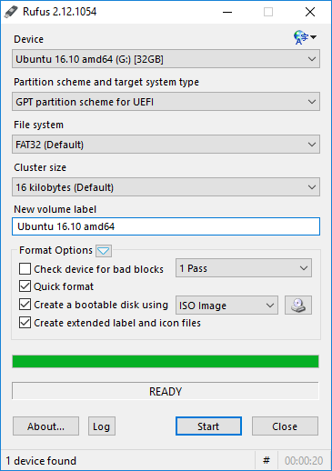

O objetivo deste tutorial é a criação uma unidade de arranque USB para instalação de sistemas operativos GNU/Linux

## Conteúdos
1. [Soluções para sistemas Microsoft Windows](#windows)
   1. [Rufus](#rufus)
2. [Soluções para sistemas UNIX-like](#unix)
   1. [dd](#dd)

## Soluções para sistemas Microsoft Windows {#windows}
### Rufus
O Rufus é uma pequena ferramenta que ajuda a formatar  e a criar unidades de arranque USB (e cartões).

Ele é especialmente útil nos casos:
+ Em que é necessário criar um meio de arranque a partir de uma imgem ISO (Windows, Linux, etc)
+ Em que é necessário utilizar um sistema live (isto é, que pode ser utilizado ser instalado)
+ Entre outros

#### Procedimento
1. Descarregue o Rufus [nesta pagina](https://rufus.akeo.ie/), em Download
2. Execute o programa. Ele tem este aspeto:

3. Escolha o dispositivo (Device). Foi escolhido o dispositivo H: neste caso
4. Caso pretenda arrancar o dipositivo num sistema BIOS, selecione MBR; Caso pretenda arranca-lo num sistema UEFI, selecione GPT (o sistema híbrido não funciona na perfeição em todos os computadores)
5. No  sistema de ficheiros, deixe a opção selecionada por omissão
6. Faça o mesmo com o “Cluster Size”
7. Em "format options" pode escolher formatar ou não o seu dispositivo (ie. Pen Drive ou cartão de memória)
8. Escolha a imagem ISO (pode descarrega-la nos Mirrors do GLUA)
9. Por fim, inicie o processo carregando em “Start“
10. Feche o programa

## Soluções para sistemas UNIX-like {#unix}
### dd
O comando dd está disponível por omissão em quase todos os sistemas UNIX-like (como o MacOS X).

~~~shell
dd if=<ficheiro de entrada> of=<ficheiro de saida> bs=<tamanho do bloco> && sync
~~~

> Não existe um tamanho de bloco (bs, block size) ideal. A influência deste parâmetro na velocidade depende do hardware envolvido. Geralmente, um tamanho como 64KB, 1MB, 4MB ou 8MB deixam este programa fazer um bom trabalho.*

Uma vez que no *NIX tudo é um ficheiro, o nosso dispositivo é representado por um. Para identificar o dispositivo, execute o comando:
~~~shell
lsblk
~~~

Exemplo:
~~~shell
dd if="/home/lricardo/Downloads/ubuntu-14.04.1-desktop-amd64.iso" of="/dev/sdc" bs=4M && sync
~~~

