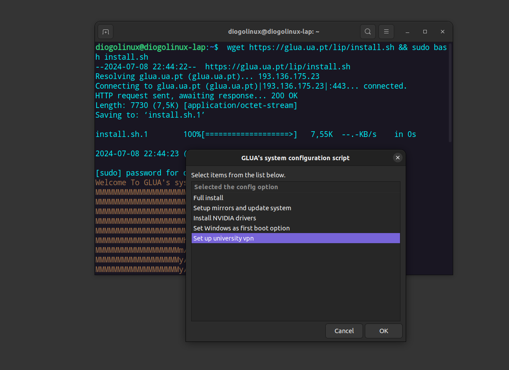

Neste tutorial pode encontrar informações de como configurar a VPN da Universidade Aveiro usando o SNX.

 
## Instalação em Ubuntu
Para Ubuntu temos dentro do nosso conjunto de scritps do glua um relativo á [configuração do sistema]( https://raw.githubusercontent.com/GLUA-UA/glua-scripts/main/glua-system-config-script/glua-system-config-script.sh ), onde uma das secções é dedicada á configuração do vpn da ua.
Quem não use ubuntu pode ver a secção [abaixo](#outras-distribuições) dedicada a outras distribuições.

Estas são as instruções para executa-lo :

```shell
cd Downloads # mudar de diretório para a localização do ficheiro
chmod +x glua-system-config-script.sh # dar premissões de execução ao ficheiro
sudo ./glua-system-config-script.sh # Executar
```

A partir dai é só seguir a interface gráfica para prosseguir com a configuração do vpn




## Utilização 
### via Web pelo go.ua.pt
* Conectar - Clique em **conectar**
* Desconectar - Clique em **desconectar**

### via linha de comando
* Conectar
~~~ shell
snx
~~~
* Desconectar
~~~ shell
snx -d
~~~


## Instalação em outras distribuições
[Clique neste link](https://supportcenter.checkpoint.com/supportcenter/portal?eventSubmit_doGoviewsolutiondetails=&solutionid=sk119772)

1. Faça download deste ficheiro [cshell_install.sh](https://go.ua.pt/sslvpn/SNX/INSTALL/cshell_install.sh)

2. Feche todas as janelas de todos os navegadores web(browser) abertos

3. Abra o terminal na pasta para onde transferiu o ficheiro

4. Dê permissões com o seguinte comando
~~~ shell
sudo chmod +x cshell_install.sh
~~~

5. Instale com o seguinte comando
~~~ shell
sudo sh cshell_install.sh
~~~

6. Crie o ficheiro **checkpoint.service** em **~/.config/systemd/user/** (*se não existir o diretório crie*)

7. Copie e cole nesse ficheiro o seguinte conteúdo
~~~
    [Unit]
    Description=checkpoint client

    [Service]
    Type=simple
    ExecStart=java -jar /usr/bin/cshell/CShell.jar /dev/shm/cshell.fifo
    KillSignal=SIGTERM
    Restart=on-failure
    RestartSec=5

    [Install]
    WantedBy=default.target
~~~

8. Dê autostart do servico através do seguinte comando, **substitua** GLUA pelo seu user
~~~ shell
    systemctl --user enable checkpoint.service
~~~

9. Crie um ficheiro com o nome **.snxrc** na pasta de usuário(exemplo "/home/glua/.snxrc") com os seguintes conteúdos, **substituindo** "glua@ua.pt" pelo seu email da ua
~~~
    server go.ua.pt
    username glua@ua.pt
    reauth yes
~~~


10. **Reinicie** o computador

11. Abra o navegador web(browser), vá a **gerir ou visualizar certificados**, geralmente localizada no separador de privacidade ou segurança

12. Em **Autoridades** importe o certificado **CShell_Certificate.crt** localizado em **/usr/bin/cshell/cert/**

13. Na página inicial do go.ua.pt clique em connect e clique **Trust**, **Confie** e **OK** em todos os popups que aparecerem

14. Ver parte da [utilização](#utilização)

